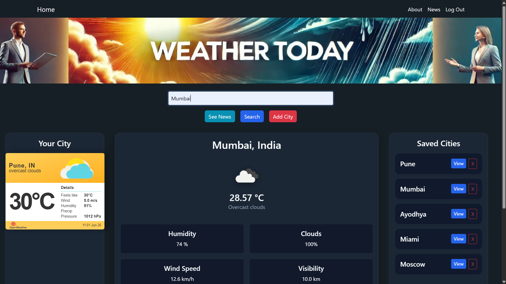
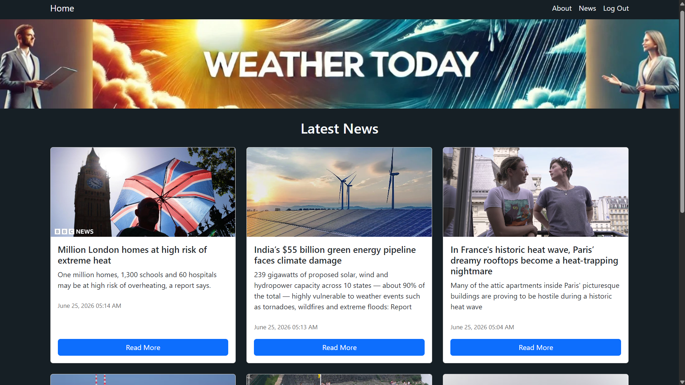

## 📌**Overview:**
Weather App is a simple and interactive web application that allows users to get real-time weather information for any city. The app fetches live weather data using
an external API and displays key details like temperature, humidity, and weather conditions in a clean and user-friendly interface. Additionally, users can view 
news related to the searched city or browse the latest news, with data fetched from an external news API.

## ✨ **Features:**
1. Search weather by city name
2. Displays real-time weather info with details like temperature, humidity, wind speed etc. (OpenWeather API)
3. Displays news related to the searched city or lets users browse the latest news
4. Dynamic data fetching using external APIs
5. User Registration and Authentication
6. User can save upto 5 cities

## 🛠️ **Tech Stack:**
1. Backend:- Python, Flask
2. Database:- MySQL (Aiven Cloud)
3. Frontend:- HTML, CSS, Bootstrap
4. APIs:- Weather & News API
5. Deployment:- Render

## 🧠 **Architecture:**
1. Designed using Flask Blueprints for modular structure
2. REST API-based request handling
3. Uses SQLAlchemy ORM for database management.
4. Template rendering using Jinja2
5. Clean separation of frontend and backend logic

## 🚀 **Live Demo:**
https://weathertoday-0lis.onrender.com/

## 📸 **Screenshots:**
### 🏠 Home Page

### 📝 News Page

## 🤝 **Contributing:**
Contributions are welcome! Feel free to fork the repository and submit a pull request.
